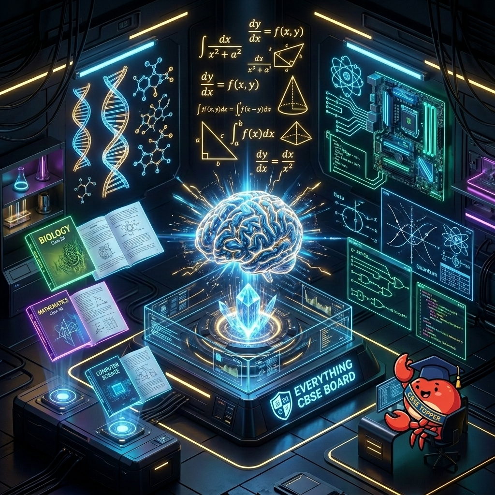

# 📘 Grade 10 Board Exam Ecosystem (ECB-10)

<div align="center">


**The high-density intelligence layer for CBSE Grade 10 Board Exams.**

[](https://cbse.gov.in)
[](#the-junior-advantage)
[](#the-junior-advantage)
[](#the-knowledge-vault)

<br />



<br />

*48 AI Skills · 7 Specialist Agents · 20 Workflow Commands · Full Obsidian Graph Integration*

</div>

---

<a name="the-junior-advantage"></a>
## 💎 The Junior Advantage (Class 10)

Grade 10 is the foundation. ECB-10 focuses on **NCERT language compliance, CBQ mastery, and exam-hall simulation**. It’s designed to turn average answers into topper-grade responses by aligning with the latest CBSE marking schemes.

### Why ECB-10?

| The Junior Challenge | ECB-10 Solution |
| :--- | :--- |
| **CBQ Paralysis** | **CBQ-Engine** — 50% of the paper is case-based. Dedicated training on decoding passage-based questions. |
| **Map Marking Errors** | `/map-quiz` — Interactive Geography map identification drill for 5 free marks. |
| **Non-NCERT Language** | `/ncertify` — Automatically rewrites student answers to match NCERT keywords and terminology. |
| **Time Management** | **Time-Manager Skill** — Provides per-section pacing blueprints (Reading/Writing/Grammar/Lit). |

<div align="center">
  
  <br />
  <sub><b>Board Exam Mastery</b> — Mastering the art of the perfect CBSE answer.</sub>
</div>

---

## 🏗️ Repository Architecture

```text
cbse-tools/
├── CBSE.md                              ← Master index (You are here)
├── AGENTS.md                            ← Autonomous orchestration brain
│
├── rules/                               ← Always-active (8 files)
│   ├── accuracy.md                      ← NCERT fact-checking
│   ├── agent-chaining.md                ← Agent-to-agent auto-triggers
│   ├── answer-format.md                 ← CBSE answer structure
│   ├── session-hooks.md                 ← Context loading hooks
│   ├── subject-detection.md             ← Auto-load correct skill
│   ├── teaching-style.md                ← Socratic method + encouragement
│   └── word-budget.md                   ← Answer-length calibration
│
├── skills/                              ← 48 skill files
│   ├── mathematics/SKILL.md             ← Full Math syllabus + formulas
│   ├── science/
│   │   ├── physics/SKILL.md             ← Light, Electricity, Magnetism
│   │   ├── chemistry/SKILL.md           ← Reactions, Acids, Carbon, Metals
│   │   └── biology/SKILL.md             ← Life Processes, Heredity, Environment
│   ├── social-science/
│   │   ├── history/SKILL.md             ← Nationalism, Movements, Print Culture
│   │   ├── geography/SKILL.md           ← Resources, Agriculture, Industry
│   │   ├── political-science/SKILL.md   ← Power Sharing, Federalism, Parties
│   │   └── economics/SKILL.md           ← Development, Sectors, Globalisation
│   ├── english/SKILL.md                 ← First Flight + Footprints + Grammar
│   ├── tamil/SKILL.md                   ← Iyal 1-6 + Ilakkanam + Writing
│   │
│   ├── cbq-engine/SKILL.md              ← 🔴 50% of paper — CBQ format mastery
│   ├── assertion-reason/SKILL.md        ← 🔴 AR decision matrix trainer
│   ├── geography-maps/SKILL.md          ← 🟢 5 free marks — 50+ locations
│   ├── topper-patterns/SKILL.md         ← Answer templates from toppers
│   ├── mistake-dna/SKILL.md             ← WHY mistakes happen (C/R/P/X/A)
│   ├── ncert-mirror/SKILL.md            ← NCERT language compliance checker
│   ├── keyword-bank/SKILL.md            ← Chapter-specific examiner keywords
│   ├── ia-optimizer/SKILL.md            ← Silent 100 marks (20/subj × 5)
│   ├── time-manager/SKILL.md            ← Per-section pacing blueprints
│   ├── exam-hall-mode/SKILL.md          ← Strict simulation rules
│   ├── mental-balance/SKILL.md          ← Burnout prevention
│   ├── concept-graph/SKILL.md           ← Prerequisite dependency chains
│   ├── spaced-repetition/SKILL.md       ← Review intervals (1/3/7/14/30 days)
│   ├── exam-strategy/SKILL.md           ← 495+ master strategy
│   ├── answer-writing/SKILL.md          ← Board exam answer craft
│   ├── question-bank/SKILL.md           ← Personal question bank builder
│   ├── revision-planner/SKILL.md        ← Multi-pass revision framework
│   ├── weak-chapter-tracker/SKILL.md    ← Mastery tracking
│   └── [30 Other Topic-Specific Skills]
│
├── agents/                              ← 7 agents
│   ├── tutor.md                         ← Socratic subject tutor
│   ├── examiner.md                      ← CBSE-style question generator
│   ├── evaluator.md                     ← Answer marker per CBSE scheme
│   ├── math-step-evaluator.md           ← Math partial-credit step marking
│   ├── case-builder.md                  ← CBQ scenario generator
│   ├── planner.md                       ← Revision schedule builder
│   └── weak-spotter.md                  ← Weak chapter identifier
│
├── commands/                            ← 20 commands
│   ├── commands.md                      ← Master command registry
│   ├── practice.md                      ← /practice
│   ├── explain.md                       ← /explain
│   ├── mock-test.md                     ← /mock-test
│   ├── mark-my-answer.md                ← /mark-my-answer
│   ├── revision-plan.md                 ← /revision-plan
│   ├── chapter-summary.md               ← /chapter-summary
│   ├── cbq-practice.md                  ← /cbq-practice
│   ├── cbq-walkthrough.md               ← /cbq-walkthrough (thinking process)
│   ├── warm-up.md                       ← /warm-up (daily 20-min habit)
│   ├── map-drill.md                     ← /map-drill (geography)
│   ├── pre-board.md                     ← /pre-board (KV/Navodaya difficulty)
│   ├── exam-hall.md                     ← /exam-hall (strict simulation)
│   ├── generate-report.md               ← /generate-report (mentor view)
│   ├── ncertify.md                      ← /ncertify (NCERT language check)
│   ├── keyword-pass.md                  ← /keyword-pass (keyword coverage)
│   ├── paper-pacing.md                  ← /paper-pacing (time budget)
│   ├── ia-plan.md                       ← /ia-plan (IA 20/20 optimizer)
│   ├── check-in.md                      ← /check-in (burnout prevention)
│   └── graph-path.md                    ← /graph-path (prerequisites)
│
└── Prasanna/                            ← Personal Knowledge Base (Obsidian Wiki)
    ├── English/                         ← Chapters & Grammar (25 notes)
    ├── Math/                            ← Chapters 1-14 (14 notes)
    ├── Science/                         ← Physics, Chemistry, Biology (13 notes)
    ├── SST/                             ← Hist, Geo, Civics, Eco (21 notes)
    ├── Tamil/                           ← Iyal 1-6 & Ilakkanam (8 notes)
    ├── Templates/                       ← Note templates (5 files)
    ├── All Diagrams.md                  ← Master Diagram Hub
    ├── All Formulas.md                  ← Master Formula Hub
    ├── Keywords Bank.md                 ← Master Keyword Hub
    ├── Topper Answer Patterns.md        ← Best Practices Hub
    └── Home.md                          ← Main Dashboard
```

---

<a name="the-knowledge-vault"></a>
## 📂 The Knowledge Vault (Prasanna)

The `Prasanna/` directory is an Obsidian-compatible knowledge graph for Class 10.

- **200+ Atomic Notes**: Every chapter of English, Math, Science, SST, and Tamil mapped out.
- **Master Hubs**:
  - `All Diagrams.md`: Labeled diagrams for Science (Biology/Physics).
  - `Keywords Bank.md`: Subject-wise lists of "Must-Include" keywords for high marks.
  - `Topper Answer Patterns.md`: Real-world examples of winning answer structures.
- **Interactive Dashboards**: Uses Dataview to track mastery levels for each chapter.

<div align="center">
  
  <br />
  <sub><b>Complete Revision</b> — All five subjects indexed and ready for retrieval.</sub>
</div>

---

## 🤖 Junior Agent Roster

| Agent | Purpose |
| :--- | :--- |
| **Socratic Tutor** | Helps students discover scientific principles and mathematical proofs on their own. |
| **Senior Examiner** | Calibrates questions to the exact difficulty levels of KV and Navodaya pre-boards. |
| **CBQ Builder** | Specializes in generating high-quality Case-Based Questions for SST and Science. |
| **Step-Evaluator** | Marks answers with the same strictness as a Board Evaluator, focusing on keyword presence. |

---

## ⌨️ Workflow Commands

- `/practice subject:science` — Triggers the Science skill + Senior Examiner agent.
- `/mock-test` — A full-length timed simulation with automatic evaluation.
- `/ncertify` — The "magic" command to align your language with NCERT standards.
- `/cbq-drill` — Intensive practice session focusing solely on Case-Based Questions.

---

<div align="center">


<br />

**"Strategy is the bridge between hard work and high scores."**

<br />

[](../README.md)
[](../README_zh.md)

</div>

