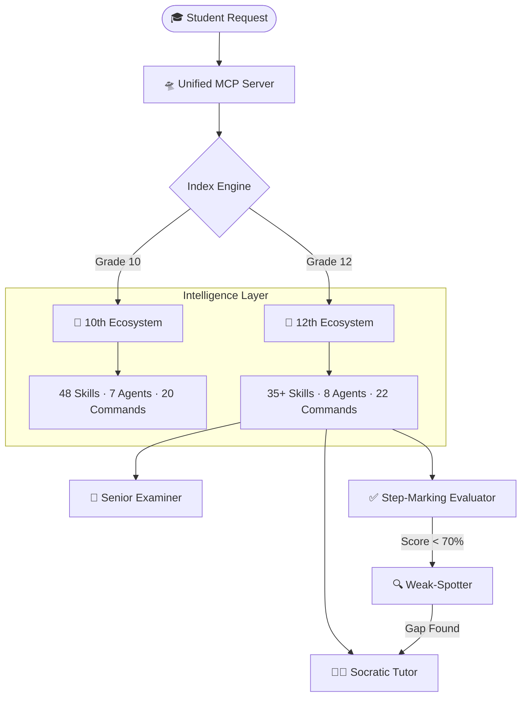

# 🎓 Everything CBSE Code (ECC)

<div align="center">


**Turn Claude into a Senior Board Examiner, Socratic Tutor, and Revision Architect — in one repo.**

[](https://cbse.gov.in)
[](https://anthropic.com)
[](#the-495-system)
[](#repository-layout)
[](https://opensource.org/licenses/MIT)

<br />


<br />

*80+ AI Skills · 15 Autonomous Agents · 200+ Obsidian Knowledge Notes · 1 Unified MCP Server*

</div>

---

## What This Actually Does

Most CBSE "study tools" give you question banks. This repo gives Claude the **complete mental model of a senior board examiner**.

Type `/practice subject:physics` in Claude Desktop. What happens next:

1. The **Subject-Detection Rule** identifies "physics" and loads the correct skill file.
2. The **Senior Examiner Agent** generates a question calibrated to CBSE marking-scheme weightage.
3. You answer. The **Step-Marking Evaluator** grades each step, not just the final answer.
4. Score below 70%? The **Weak-Spotter Agent** fires automatically, identifies the exact knowledge gap, and hands off to the **Socratic Tutor** for targeted re-teaching.

No manual switching. No copy-pasting prompts. It's agent chaining — one command, four AI specialists.

<div align="center">
  
  <br />
  <sub><b>Claw "The Architect"</b> — Building the intelligence layer, one skill at a time.</sub>
</div>

---

<a name="the-495-system"></a>
## 💎 Why Everything CBSE Code?

In the high-stakes world of CBSE Board Exams, the difference between ** 95% ** and
** 99% ** isn't just knowledge-it's ** strategy, precision, and marking-scheme
alignment **.

** Everything CBSE Code (ECC) ** is a high-density, agentic framework designed for
students aiming for the ** Top 0.1% **. It bridges the gap between raw NCERT
content and professional examiner expectations using the ** Model Context
Protocol (MCP) ** and ** Autonomous Agent Chaining **.

[!IMPORTANT]
> ** ECC is not just a study tool; it's a "Second Brain" calibrated to the CBSE
DNA. **

The gap between 95% and 99% in CBSE isn't knowledge. It's three things:

| Pain Point | What Students Do | What ECC Does |
| :--- | :--- | :--- |
| **Careless errors** | "I'll be more careful next time" | Runs a 5-type error DNA classifier (Conceptual / Reading / Procedural / Exam-pressure / Attention) |
| **CBQ paralysis** | Reads the passage, panics, writes too much | Dedicated CBQ Engine with a 4-step decode framework for the 50% case-based paper |
| **Missing keywords** | Writes correct answers that still lose marks | Keyword-density analyzer trained on CBSE marking schemes |
| **Time blowouts** | Spends 20 min on a 3-mark question | Pacing protocol calibrated to marks-per-minute across subjects |

<div align="center">
  
  <br />
  <sub><b>495+/500</b> — That's the target. Every skill in this repo is calibrated to get there.</sub>
</div>

---

## System Architecture

ECC uses the [Model Context Protocol (MCP)](https://modelcontextprotocol.io/) to expose 80+ skills directly to Claude Desktop through a local stdio server. No API keys. No cloud dependency. Everything runs on your machine.



<div align="center">
  
  <br />
  <sub>Every NCERT textbook for Class 10 & 12 — indexed, searchable, and cross-referenced by the MCP server.</sub>
</div>

---

## Feature Breakdown

<table>
  <tr>
    <td width="100" align="center"></td>
    <td><b>🧠 Unified MCP Intelligence</b><br/>A custom stdio server exposing 80+ skills and 200+ personal notes directly to Claude Desktop. One server, both grades, instant retrieval.</td>
  </tr>
  <tr>
    <td width="100" align="center"></td>
    <td><b>🧪 NCERT-Mirror Science Engine</b><br/>Every interaction cross-referenced against NCERT gold standards. Answers formatted exactly how examiners expect — diagrams, equations, labeled steps.</td>
  </tr>
  <tr>
    <td width="100" align="center"></td>
    <td><b>📚 200+ Note Revision Vault</b><br/>An Obsidian-compatible knowledge vault with atomic notes, Dataview trackers, and spaced-repetition cues. Not a brain dump — a graph-navigable study system.</td>
  </tr>
  <tr>
    <td width="100" align="center"></td>
    <td><b>🏆 495+ Strategy Protocols</b><br/>Deep-dive strategy hubs for high-weightage topics: Calculus, Organic Chemistry, Genetics, Map Work, CBQs. Each with dedicated scoring playbooks.</td>
  </tr>
  <tr>
    <td width="100" align="center"></td>
    <td><b>⌨️ Slash-Command Workflows</b><br/>42 slash commands across both grades. One command triggers multi-step workflows: <code>/practice</code>, <code>/mock-test</code>, <code>/mark-my-answer</code>, <code>/derivation-drill</code>.</td>
  </tr>
</table>

---

## Repository Layout

```text
everything-cbse-code/
│
├── 📘 10th/                                  ← Grade 10 Ecosystem
│   ├── CBSE.md                               ← Master Index
│   ├── AGENTS.md                             ← Agent Orchestration
│   ├── rules/                (8 files)       ← Always-active guardrails
│   ├── skills/               (48 skills)     ← Subject-specific intelligence
│   │   ├── mathematics/                      ← Full syllabus + formulas
│   │   ├── science/                          ← Physics, Chemistry, Biology
│   │   ├── social-science/                   ← History, Geo, PolSci, Eco
│   │   ├── english/                          ← Literature & Grammar
│   │   ├── tamil/                            ← Iyal 1–6 + Ilakkanam
│   │   ├── cbq-engine/                       ← 🔴 Case-Based Question mastery
│   │   ├── assertion-reason/                 ← 🔴 AR decision matrix
│   │   ├── geography-maps/                   ← 🟢 5 free marks, 50+ locations
│   │   ├── topper-patterns/                  ← Answer templates from toppers
│   │   └── mistake-dna/                      ← Error analysis (C/R/P/X/A)
│   ├── agents/               (7 agents)      ← Tutor, Examiner, Evaluator...
│   ├── commands/             (20 commands)    ← /practice, /mock-test, etc.
│   └── Prasanna/                             ← Obsidian Knowledge Vault
│       └── 🏠 Home.md                        ← Grade 10 Dashboard
│
├── 📙 12th/                                  ← Grade 12 Ecosystem
│   ├── CBSE12.md                             ← Master Index
│   ├── AGENTS.md                             ← Agent Orchestration
│   ├── rules/                (8 files)       ← Derivation-first, detection, etc.
│   ├── skills/               (35+ skills)    ← PCMB & PCMC specialized
│   │   ├── shared/                           ← Physics, Chemistry, Mathematics
│   │   ├── pcmb/                             ← Biology + NEET strategy
│   │   ├── pcmc/                             ← Computer Science + JEE strategy
│   │   ├── common/                           ← English, CBQ, derivations
│   │   ├── derivation-bank/                  ← Master repository of proofs
│   │   └── practical-guide/                  ← 30-mark Practical/Viva prep
│   ├── agents/               (8 agents)      ← Practical-examiner, NEET, JEE...
│   ├── commands/             (22 commands)    ← /derivation-drill, /neet-mcq...
│   └── Prasanna-12/                          ← Senior Knowledge Vault
│       └── Home.md                           ← Grade 12 Dashboard
│
├── 🛸 mcp-server/                            ← Unified MCP Brain
│   ├── src/index.ts                          ← Server entry point
│   ├── src/server.ts                         ← Multi-grade routing logic
│   ├── src/lib/                              ← Indexer & security
│   └── src/tools/                            ← Grade-aware toolsets
│
├── 📖 README.md                              ← You are here
└── 📖 README_zh.md                           ← 中文文档
```

---

## Quick Start

Three steps. Under 2 minutes.

### 1. Clone & Build

```bash
# Clone and build the brain
git clone https://github.com/vishnu-tppr/everything-cbse-code.git
cd everything-cbse-code/mcp-server
npm install && npm run build
```

### 2. Connect to Claude Desktop

Add to `%APPDATA%\Claude\claude_desktop_config.json`:

```json
{
  "mcpServers": {
    "everything-cbse": {
      "command": "node",
      "args": ["C:/PATH/TO/everything-cbse-code/mcp-server/dist/index.js"]
    }
  }
}
```

### 3. Start Studying

Open Claude Desktop and try:

```
/practice subject:mathematics topic:calculus difficulty:board
```

The agent chain handles the rest.

---

## The Agent Roster

| Agent | Grade | What It Does |
| :--- | :---: | :--- |
| **Socratic Tutor** | 10 & 12 | Never gives the answer directly. Guides through questions until the student reaches it themselves. |
| **Senior Examiner** | 10 & 12 | Generates questions calibrated to CBSE weightage, difficulty, and question-type distribution. |
| **Step-Marking Evaluator** | 10 & 12 | Grades each step independently — exactly how a real CBSE examiner marks papers. |
| **Weak-Spotter** | 10 & 12 | Triggered automatically on low scores. Identifies the exact concept gap. |
| **Case-Builder** | 10 | Specializes in constructing CBQ (Case-Based Question) practice sets. |
| **Practical Examiner** | 12 | Covers 30-mark practicals: salt analysis, circuit diagrams, viva voce. |
| **NEET Drill** | 12 (PCMB) | NEET-pattern MCQ generation with negative-marking simulation. |
| **JEE Drill** | 12 (PCMC) | JEE Main/Advanced pattern questions with time pressure. |

---

## What's Inside the Knowledge Vault

The `Prasanna/` and `Prasanna-12/` directories are Obsidian-compatible knowledge vaults. Not raw notes — structured, graph-navigable study systems.

- **200+ atomic knowledge files** — one concept per file, backlinked
- **Dataview mastery trackers** — query your progress across subjects
- **Master hubs** — Formula sheets, diagram indexes, keyword banks
- **Spaced-repetition cues** — built into note metadata

<div align="center">
  
  <br />
  <sub>All five NCERT subjects. Indexed. Cross-referenced. Ready for revision.</sub>
</div>

---

## Slash Commands

A sample of the 42 slash commands available:

**Grade 10:**
| Command | Effect |
| :--- | :--- |
| `/practice subject:science` | Generates CBSE-weighted practice questions |
| `/mock-test` | Full timed mock with auto-evaluation |
| `/mark-my-answer` | Step-by-step marking with keyword check |
| `/ncertify` | Rewrites your answer in NCERT-approved language |
| `/cbq-drill` | Case-Based Question intensive session |
| `/map-quiz` | Interactive geography map identification |

**Grade 12:**
| Command | Effect |
| :--- | :--- |
| `/derivation-drill` | Random derivation with step-checking |
| `/practical-check` | Viva simulation with salt analysis |
| `/neet-mcq topic:genetics` | NEET-pattern MCQ with negative marking |
| `/jee-mcq topic:calculus` | JEE pattern with time pressure |
| `/12th/practice subject:chemistry` | Board-exam weighted chemistry practice |

---

## For Developers & Contributors

ECC is fully open source. The MCP server is built with:

- **Runtime**: Node.js 20+ with TypeScript
- **MCP SDK**: `@modelcontextprotocol/sdk` (latest)
- **Validation**: Zod schemas for all tool inputs
- **Security**: Filesystem traversal guards — reads only within the repo

```text
mcp-server/
├── src/
│   ├── index.ts              ← Entry point (stdio transport)
│   ├── server.ts             ← Multi-grade routing + tool registration
│   ├── lib/
│   │   ├── indexer.ts        ← Startup file indexer (skills, agents, notes)
│   │   └── security.ts       ← Path validation & traversal guards
│   └── tools/
│       ├── grade10Tools.ts    ← 10th-specific tool handlers
│       └── grade12Tools.ts    ← 12th-specific tool handlers
├── package.json
└── tsconfig.json
```

Want to add a skill? Create a `SKILL.md` in the right subject folder. The indexer picks it up automatically on next server start.

---

## Star History & Community

If this repo helps you gain even **1 extra mark** on your boards, a ⭐ is the best way to say thanks.

- **Creator**: [Vishnu](https://github.com/vishnu-tppr)
- **Batch**: Built for the 2026–27 Board Exam cycle
- **Status**: Production-ready. Used daily for real exam prep.
- **License**: [MIT](LICENSE) — fork it, adapt it, build on it.

---

<div align="center">


<br />

**For those who don't just want to pass, but want to lead.**

<br />

[](https://github.com/vishnu-tppr/everything-cbse-code)
[](https://github.com/vishnu-tppr/everything-cbse-code)

</div>
