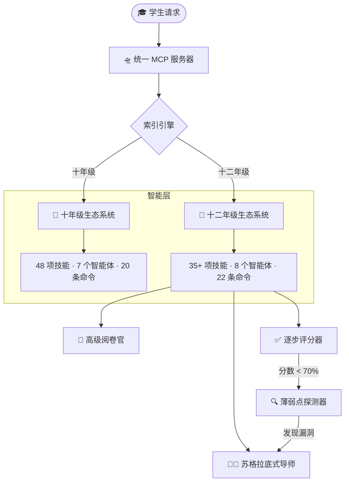

# 🎓 Everything CBSE Code (ECC)

<div align="center">


**将 Claude 变成高级阅卷官、苏格拉底式导师和复习架构师 — 一个仓库搞定一切。**

[](https://cbse.gov.in)
[](https://anthropic.com)
[](#the-495-system)
[](#repository-layout)
[](https://opensource.org/licenses/MIT)

<br />


<br />

*80+ AI 技能 · 15 个自主智能体 · 200+ Obsidian 知识笔记 · 1 个统一 MCP 服务器*

</div>

---

## 这个项目到底做什么？

大多数 CBSE"学习工具"只提供题库。这个仓库赋予 Claude **一位高级阅卷官的完整思维模型**。

在 Claude Desktop 中输入 `/practice subject:physics`，然后会发生以下事情：

1. **学科识别规则**识别"physics"并加载对应的技能文件。
2. **高级阅卷官智能体**生成一道根据 CBSE 评分方案权重校准的试题。
3. 你作答。**逐步评分器**对每一步进行评分，而不仅仅评判最终答案。
4. 得分低于 70%？**薄弱点探测器**自动触发，精确定位知识漏洞，并将问题移交给**苏格拉底式导师**进行针对性补习。

无需手动切换。无需复制粘贴提示词。这是智能体链——一条命令，四位 AI 专家。

<div align="center">
  
  <br />
  <sub><b>Claw「架构师」</b> — 一个技能一个技能地构建智能层。</sub>
</div>

---

<a name="the-495-system"></a>
## 💎 为什么选择 Everything CBSE Code？

在 CBSE 高考的高压世界中，**95%** 和 **99%** 之间的差距不仅仅是知识——而是**策略、精确度和评分方案的对齐**。

**Everything CBSE Code (ECC)** 是一个高密度的智能体驱动框架，专为冲击**前 0.1%** 的学生设计。它利用**模型上下文协议（MCP）**和**自主智能体链**，弥合原始 NCERT 内容与专业阅卷官期望之间的鸿沟。

[!IMPORTANT]
> **ECC 不仅仅是学习工具；它是一个校准到 CBSE 基因的「第二大脑」。**

在 CBSE 中，95% 和 99% 之间的差距不是知识，而是三件事：

| 痛点 | 学生通常怎么做 | ECC 怎么做 |
| :--- | :--- | :--- |
| **粗心错误** | "下次我会更仔细的" | 运行 5 类错误 DNA 分类器（概念/审题/流程/考试压力/注意力） |
| **CBQ（案例题）恐惧症** | 读材料、慌张、写太多 | 专用 CBQ 引擎，采用 4 步解码框架应对 50% 的案例题 |
| **遗漏关键词** | 答案正确但仍然丢分 | 基于 CBSE 评分方案训练的关键词密度分析器 |
| **时间失控** | 在 3 分题上花 20 分钟 | 按照各科目"分数/分钟"校准的时间控制协议 |

<div align="center">
  
  <br />
  <sub><b>495+/500</b> — 这就是目标。这个仓库中的每项技能都为此校准。</sub>
</div>

---

## 系统架构

ECC 使用[模型上下文协议（MCP）](https://modelcontextprotocol.io/)通过本地 stdio 服务器将 80+ 技能直接暴露给 Claude Desktop。无需 API 密钥。无需云依赖。一切在你的机器上运行。



<div align="center">
  
  <br />
  <sub>十年级和十二年级的所有 NCERT 教科书 — 已索引、可搜索、由 MCP 服务器交叉引用。</sub>
</div>

---

## 功能详解

<table>
  <tr>
    <td width="100" align="center"></td>
    <td><b>🧠 统一 MCP 智能</b><br/>自定义 stdio 服务器，将 80+ 技能和 200+ 个人笔记直接暴露给 Claude Desktop。一个服务器，两个年级，即时检索。</td>
  </tr>
  <tr>
    <td width="100" align="center"></td>
    <td><b>🧪 NCERT 镜像科学引擎</b><br/>每次交互都与 NCERT 黄金标准进行交叉验证。答案格式完全按照阅卷官的期望排版——图表、方程式、标注步骤。</td>
  </tr>
  <tr>
    <td width="100" align="center"></td>
    <td><b>📚 200+ 笔记复习库</b><br/>兼容 Obsidian 的知识库，包含原子笔记、Dataview 追踪器和间隔重复提示。不是信息堆砌——而是图谱可导航的学习系统。</td>
  </tr>
  <tr>
    <td width="100" align="center"></td>
    <td><b>🏆 495+ 冲刺策略协议</b><br/>针对高权重主题的深度策略中心：微积分、有机化学、遗传学、地图作业、CBQ。每个主题都有专属的得分攻略手册。</td>
  </tr>
  <tr>
    <td width="100" align="center"></td>
    <td><b>⌨️ 斜杠命令工作流</b><br/>两个年级共 42 条斜杠命令。一条命令触发多步骤工作流：<code>/practice</code>、<code>/mock-test</code>、<code>/mark-my-answer</code>、<code>/derivation-drill</code>。</td>
  </tr>
</table>

---

<a name="repository-layout"></a>
## 🏗️ 仓库架构详解

Everything CBSE Code (ECC) 生态系统是一个高密度的智能层。以下是连接十年级、十二年级和 MCP 大脑的统一架构图。

```text
everything-cbse-code/
│
├── 📘 10th/                             ← 十年级备考生态 (Class 10)
│   ├── CBSE.md                          ← 主索引
│   ├── AGENTS.md                        ← 自主智能体编排大脑
│   ├── rules/                           ← 始终生效的规则 (8 个)
│   │   ├── accuracy.md                  ← NCERT 事实核查
│   │   ├── agent-chaining.md                ← 智能体自动链式触发
│   │   ├── answer-format.md             ← CBSE 答题结构
│   │   ├── session-hooks.md                 ← 上下文加载钩子
│   │   ├── subject-detection.md         ← 自动加载正确技能
│   │   ├── teaching-style.md            ← 苏格拉底式教学
│   │   └── word-budget.md                   ← 字数校准
│   ├── skills/                          ← 48 项技能文件
│   │   ├── mathematics/SKILL.md         ← 完整数学大纲 + 公式
│   │   ├── science/
│   │   │   ├── physics/SKILL.md         ← 光学、电学、磁学
│   │   │   ├── chemistry/SKILL.md       ← 反应、酸碱盐、碳、金属
│   │   │   └── biology/SKILL.md         ← 生命过程、遗传、环境
│   │   ├── social-science/
│   │   │   ├── history/SKILL.md         ← 民族主义、运动、印刷文化
│   │   │   ├── geography/SKILL.md       ← 资源、农业、工业
│   │   │   ├── political-science/SKILL.md ← 权力分享、联邦制、政党
│   │   │   └── economics/SKILL.md       ← 发展、部门、全球化
│   │   ├── english/SKILL.md             ← 文学与语法
│   │   ├── tamil/SKILL.md               ← 第 1-6 单元 + 语法
│   │   ├── cbq-engine/SKILL.md          ← 🔴 案例题 (CBQ) 精通
│   │   ├── assertion-reason/SKILL.md    ← 🔴 断言-推理决策矩阵
│   │   ├── geography-maps/SKILL.md      ← 🟢 5 分必拿 — 50+ 地图地点
│   │   ├── mistake-dna/SKILL.md         ← 错误原因分析 (C/R/P/X/A)
│   │   ├── topper-patterns/SKILL.md     ← 状元答题模板
│   │   └── [其他 30 项技能]              ← 时间管理、IA 优化等
│   ├── agents/                          ← 7 个智能体
│   │   ├── tutor.md                         ← 苏格拉底式学科导师
│   │   ├── examiner.md                      ← CBSE 风格试题生成器
│   │   ├── evaluator.md                     ← 评分方案阅卷官
│   │   ├── math-step-evaluator.md           ← 数学步骤分评估器
│   │   └── weak-spotter.md                  ← 薄弱点识别专家
│   ├── commands/                        ← 20 条命令
│   │   ├── practice.md                      ← /practice
│   │   ├── mock-test.md                     ← /mock-test
│   │   ├── cbq-drill.md                     ← /cbq-drill
│   │   └── ncertify.md                      ← /ncertify (NCERT 检查)
│   └── Prasanna/                        ← Obsidian 知识库
│       ├── Math/                        # 14 条章节笔记
│       ├── Science/                     # 13 条物化生笔记
│       ├── SST/                         # 21 条史地政经笔记
│       └── 🏠 Home.md                   ← 十年级主仪表盘
│
├── 📙 12th/                             ← 十二年级备考生态 (PCMB/PCMC)
│   ├── CBSE12.md                        ← 主索引
│   ├── AGENTS.md                        ← 自主智能体编排大脑
│   ├── rules/                           ← 始终生效的规则 (8 个)
│   │   ├── derivation-first.md          ← 推导与证明优先
│   │   ├── subject-detection.md         ← 分流识别 (PCMB/PCMC)
│   │   └── [其他 6 条规则]               ← 准确性、钩子、风格等
│   ├── skills/                          ← 35+ 项专用技能
│   │   ├── shared/                      ← 物理、化学、数学
│   │   ├── pcmb/                            ← 生物 + NEET 策略
│   │   ├── pcmc/                            ← 计算机科学 + JEE 策略
│   │   ├── common/                          ← 英语、CBQ、推导
│   │   ├── derivation-bank/SKILL.md     ← 证明推导总库
│   │   ├── practical-guide/SKILL.md     ← 30 分实验与口试指南
│   │   └── topper-patterns/SKILL.md     ← 状元答题模板
│   ├── agents/                          ← 8 个智能体
│   │   ├── practical-examiner.md            ← 口试与实验考官
│   │   ├── neet-drill.md                    ← NEET 题型生成器
│   │   ├── jee-drill.md                     ← JEE 题型生成器
│   │   └── [其他 5 个智能体]               ← 导师、考官、评分官等
│   ├── commands/                        ← 22 条命令
│   │   ├── derivation-drill.md              ← /derivation-drill
│   │   ├── neet-mcq.md                      ← /neet-mcq
│   │   ├── jee-mcq.md                       ← /jee-mcq
│   │   └── [其他 19 条命令]                ← 练习、模拟、报告等
│   └── Prasanna-12/                     ← 高年级知识库
│       ├── Physics/                     # 高密度章节笔记
│       ├── Chemistry/                   # 有机/无机/物理化学
│       └── Home.md                      ← 十二年级主仪表盘
│
├── 🛸 mcp-server/                       ← 统一 MCP 大脑 (Node.js/TS)
│   ├── src/                             # TypeScript 源码
│   │   ├── index.ts                     ← 服务器入口 (Stdio 传输)
│   │   ├── server.ts                    ← 多年级路由逻辑
│   │   ├── lib/                         ← 核心智能模块
│   │   │   ├── indexer.ts               ← 分层模糊索引器
│   │   │   └── fs.ts                    ← 安全路径解析器
│   │   └── tools/                       ← 年级感知工具集
│   │       ├── core.ts                  ← 资源管理
│   │       ├── skills.ts                ← 技能查找与打包
│   │       ├── agents.ts                ← 智能体人格注入
│   │       ├── commands.ts              ← 工作流编排
│   │       ├── notes.ts                 ← 知识库检索引擎
│   │       └── search.ts                ← 语义搜索接口
│   ├── package.json                     ← SDK 与构建依赖
│   └── tsconfig.json                    ← TypeScript 配置
│
├── 📖 README.md                         ← 英文文档
└── 📖 README_zh.md                      ← 你在这里
```

---

## 快速开始

三个步骤。不到 2 分钟。

### 1. 克隆与构建

```bash
# 克隆并构建大脑
git clone https://github.com/vishnu-tppr/everything-cbse-code.git
cd everything-cbse-code/mcp-server
npm install && npm run build
```

### 2. 连接到 Claude Desktop

添加到 `%APPDATA%\Claude\claude_desktop_config.json`：

```json
{
  "mcpServers": {
    "everything-cbse": {
      "command": "node",
      "args": ["C:/PATH/TO/everything-cbse-code/mcp-server/dist/index.js"]
    }
  }
}
```

### 3. 开始学习

打开 Claude Desktop 并尝试：

```
/practice subject:mathematics topic:calculus difficulty:board
```

智能体链会处理其余的一切。

---

## 智能体阵容

| 智能体 | 年级 | 功能说明 |
| :--- | :---: | :--- |
| **苏格拉底式导师** | 10 & 12 | 从不直接给出答案。通过提问引导学生自行得出结论。 |
| **高级阅卷官** | 10 & 12 | 生成根据 CBSE 权重、难度和题型分布校准的试题。 |
| **逐步评分器** | 10 & 12 | 对每一步独立评分 — 完全模拟真实 CBSE 阅卷流程。 |
| **薄弱点探测器** | 10 & 12 | 在低分时自动触发。精确定位知识漏洞。 |
| **案例题构造器** | 10 | 专门构造 CBQ（案例题）练习集。 |
| **实验考官** | 12 | 涵盖 30 分实验：盐类分析、电路图、口试答辩。 |
| **NEET 刷题机** | 12 (PCMB) | 生成 NEET 题型的选择题，含倒扣分模拟。 |
| **JEE 刷题机** | 12 (PCMC) | JEE 主考/高考题型，含限时压力。 |

---

## 知识库里有什么

`Prasanna/` 和 `Prasanna-12/` 目录是兼容 Obsidian 的知识库。不是原始笔记——而是结构化的、图谱可导航的学习系统。

- **200+ 原子知识文件** — 每个文件一个概念，互相反向链接
- **Dataview 掌握度追踪器** — 查询各科目的学习进度
- **主题中心** — 公式表、图表索引、关键词库
- **间隔重复提示** — 内嵌于笔记元数据中

<div align="center">
  
  <br />
  <sub>五科 NCERT 教材。已索引。交叉引用。随时可复习。</sub>
</div>

---

## 斜杠命令

共 42 条斜杠命令示例：

**十年级：**
| 命令 | 效果 |
| :--- | :--- |
| `/practice subject:science` | 生成 CBSE 权重练习题 |
| `/mock-test` | 完整计时模拟考 + 自动评估 |
| `/mark-my-answer` | 逐步评分 + 关键词检查 |
| `/ncertify` | 将你的答案改写为 NCERT 标准用语 |
| `/cbq-drill` | 案例题强化训练 |
| `/map-quiz` | 互动地理地图辨识 |

**十二年级：**
| 命令 | 效果 |
| :--- | :--- |
| `/derivation-drill` | 随机推导 + 步骤检查 |
| `/practical-check` | 口试模拟 + 盐类分析 |
| `/neet-mcq topic:genetics` | NEET 题型选择题 + 倒扣分 |
| `/jee-mcq topic:calculus` | JEE 题型 + 限时压力 |
| `/12th/practice subject:chemistry` | 考试权重化学练习 |

---

## 面向开发者与贡献者

ECC 完全开源。MCP 服务器的技术栈：

- **运行时**: Node.js 20+ 搭配 TypeScript
- **MCP SDK**: `@modelcontextprotocol/sdk`（最新版）
- **验证**: 所有工具输入均使用 Zod 模式验证
- **安全**: 文件系统遍历防护 — 仅读取仓库内文件

```text
mcp-server/
├── src/
│   ├── index.ts              ← 入口（stdio 传输）
│   ├── server.ts             ← 多年级路由 + 工具注册
│   ├── lib/
│   │   ├── indexer.ts        ← 启动时文件索引器（技能、智能体、笔记）
│   │   └── security.ts       ← 路径验证与遍历防护
│   └── tools/
│       ├── grade10Tools.ts    ← 十年级专用工具处理
│       └── grade12Tools.ts    ← 十二年级专用工具处理
├── package.json
└── tsconfig.json
```

想添加技能？在对应的科目文件夹中创建一个 `SKILL.md`。索引器会在下次服务器启动时自动识别。

---

## Star 历史与社区

如果这个仓库帮助你在考试中多拿了哪怕 **1 分**，一个 ⭐ 就是最好的感谢方式。

- **创建者**: [Vishnu](https://github.com/vishnu-tppr)
- **适用批次**: 为 2026–27 年考试周期打造
- **状态**: 生产就绪。每天用于真实的备考学习。
- **许可证**: [MIT](LICENSE) — 随意 fork、改编、二次开发。

---

<div align="center">


<br />

**献给那些不仅想通过考试，更想引领的人。**

<br />

[](https://github.com/vishnu-tppr/everything-cbse-code)
[](https://github.com/vishnu-tppr/everything-cbse-code)

</div>
